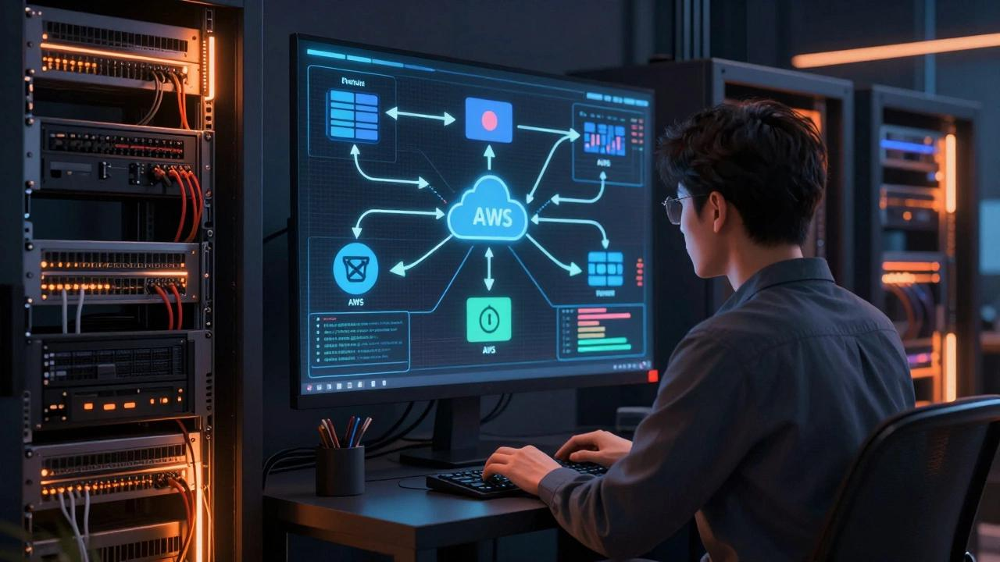

# aws-cloudwatch-infrastructure-monitoring
AWS infrastructure monitoring, log management, event-driven notifications, compliance and troubleshooting with CloudWatch, EC2, SNS, EventBridge and AWS Config.

 

  
  
  
  
  
  

  

