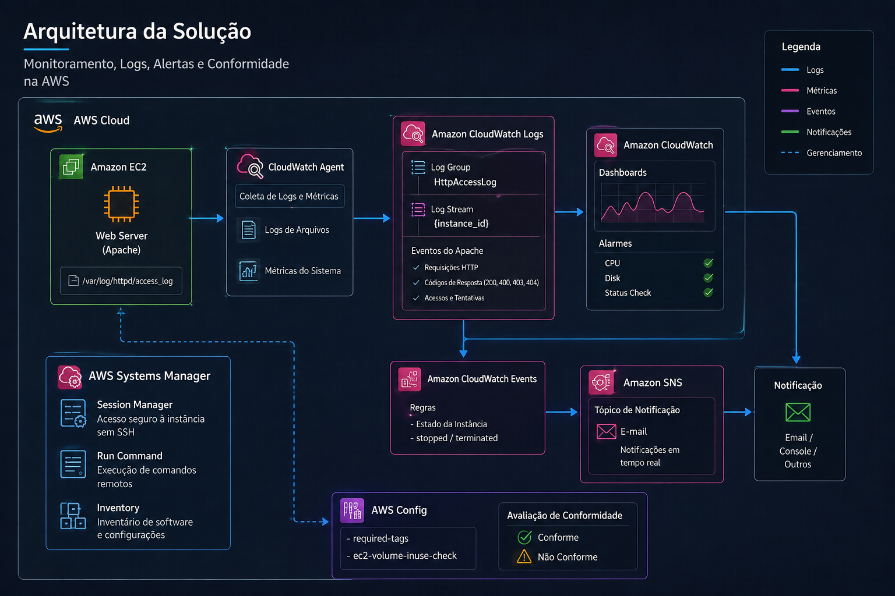
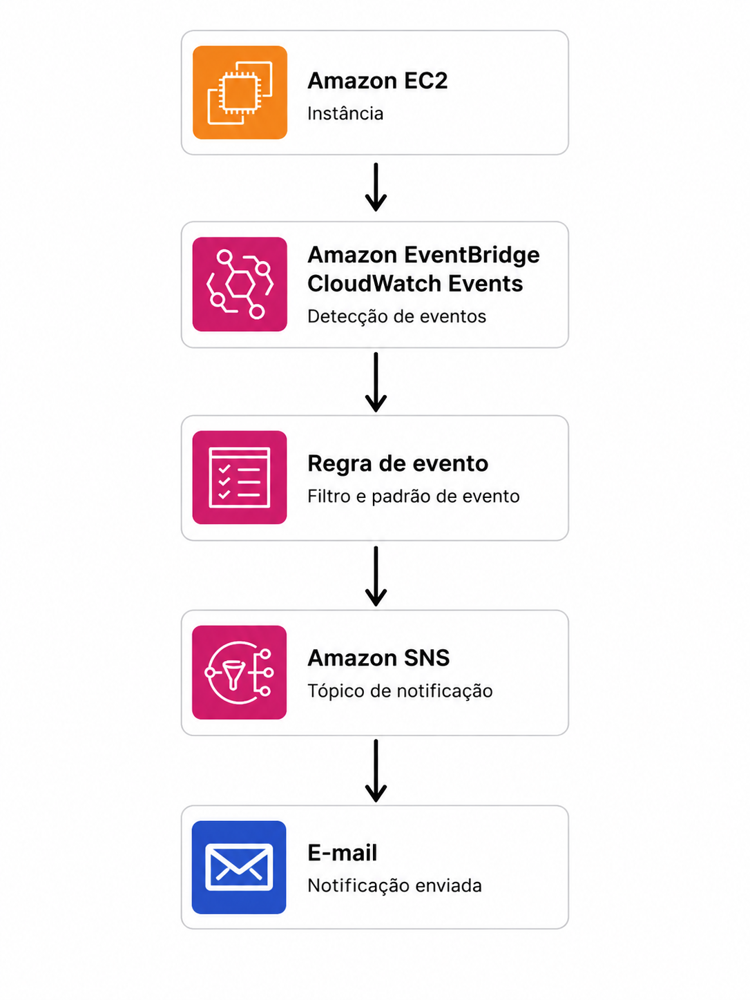
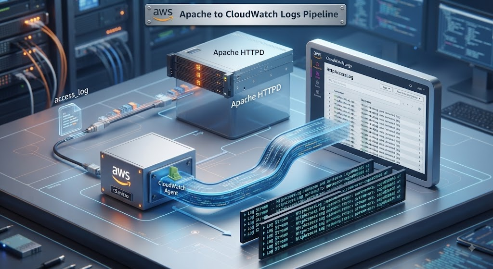
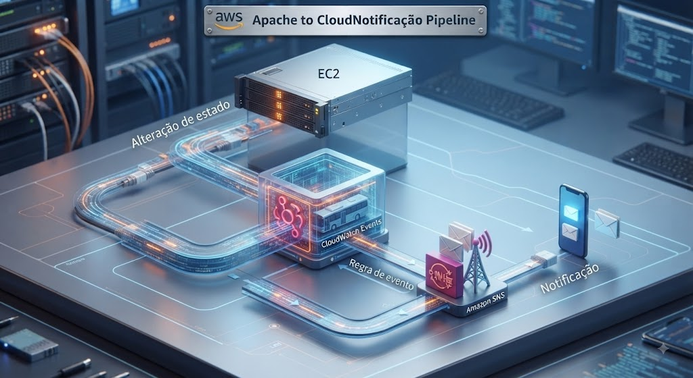
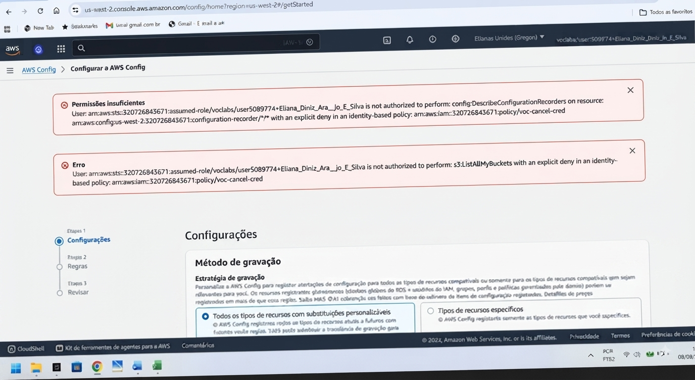
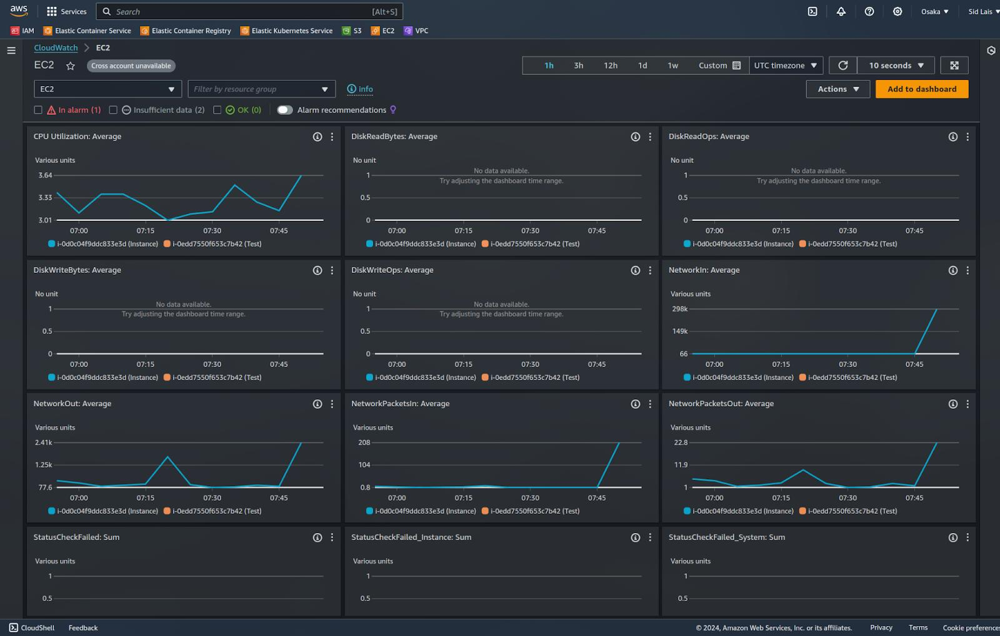

## aws-infrastructure-observability
AWS infrastructure monitoring, log management, event-driven notifications, compliance and troubleshooting with CloudWatch, EC2, SNS, EventBridge and AWS Config.

 

  
  
  
  
  
  

  

## Sobre o laboratório

O LAB 186 — Monitorar a Infraestrutura AWS apresenta, na prática, como utilizar serviços da AWS para monitorar recursos computacionais, coletar e analisar logs, identificar eventos operacionais, gerar notificações e avaliar a conformidade da infraestrutura.

Durante o laboratório, uma instância Amazon EC2 Web Server foi utilizada como recurso principal para demonstrar um cenário integrado de monitoramento e observabilidade.

A atividade envolveu a integração de diferentes serviços da AWS, permitindo acompanhar o ambiente desde a geração dos eventos no servidor até sua coleta, análise, notificação e avaliação de conformidade.

## Principais componentes

Amazon EC2 — recurso computacional monitorado
Amazon CloudWatch — monitoramento e observabilidade
CloudWatch Logs — coleta, armazenamento e análise de logs
CloudWatch Agent — coleta de logs diretamente da instância
AWS Systems Manager — gerenciamento e troubleshooting da instância
Amazon SNS — envio de notificações
Amazon EventBridge / CloudWatch Events — detecção de eventos operacionais
AWS Config — avaliação de conformidade
Amazon EBS — volumes avaliados pelas regras de conformidade
IAM — gerenciamento de permissões

## Objetivo

O laboratório teve como foco desenvolver uma visão prática de Cloud Operations e Observabilidade na AWS, demonstrando não apenas a configuração dos serviços, mas também a capacidade de investigar problemas, identificar causas, aplicar correções e validar tecnicamente os resultados.

## Arquitetura da Solução

A arquitetura abaixo representa a integração dos principais serviços AWS utilizados no laboratório, desde o monitoramento da instância EC2 e coleta dos logs do Apache até o processamento de eventos, notificações e avaliação de conformidade.

  

## Tech Stack & Lab Architecture 

AWS Services

         

### Technologies & Components

Component	                  Application in the Lab

Amazon EC2	                 Web Server utilizado como recurso principal monitorado
Apache HTTPD	               Servidor Web responsável pela geração dos logs
CloudWatch Agent            Coleta dos logs do Apache diretamente da instância
CloudWatch                  Logs	Armazenamento e análise dos eventos coletados
Amazon EventBridge	         Detecção de eventos relacionados à infraestrutura
Amazon SNS	                 Envio de notificações
AWS Systems Manager	        Gerenciamento da instância e troubleshooting
AWS Config	                 Avaliação da conformidade dos recursos
Amazon EBS	                 Volumes avaliados pelas regras de conformidade
IAM	                        Controle de permissões e acesso aos recursos

O laboratório demonstrou que monitoramento não significa apenas visualizar métricas.

Uma infraestrutura realmente observável exige a integração entre métricas, logs, eventos, notificações, gerenciamento e conformidade, permitindo identificar problemas e tomar ações baseadas em evidências.

Problema → Investigação → Correção → Validação

Esse ciclo de troubleshooting foi um dos principais aprendizados práticos desenvolvidos durante o laboratório.

## Tarefas Executadas

O laboratório foi desenvolvido em cinco etapas, integrando monitoramento, observabilidade, coleta de logs, notificações, gerenciamento e conformidade em um ambiente AWS.

## 1 - Monitoramento da infraestrutura

A primeira etapa teve como objetivo compreender o ambiente e identificar os recursos utilizados no monitoramento.

A instância Amazon EC2 Web Server foi utilizada como principal recurso computacional.

Durante a análise foram observados:

Estado operacional da instância;
Métricas do EC2;
Comportamento do servidor Web;
Acessos HTTP;
Arquivos de log;
Configurações da infraestrutura.

Essa etapa estabeleceu a base para as atividades de observabilidade realizadas nas etapas seguintes.

## 2️ - Monitoramento e notificações

Nesta etapa foi implementado um mecanismo para detectar alterações no estado da infraestrutura e gerar notificações.

  

A regra foi configurada para identificar alterações nos estados:

stopped
terminated

O Amazon SNS foi utilizado como mecanismo de entrega das notificações.

O objetivo foi demonstrar como eventos operacionais podem ser detectados e encaminhados automaticamente para os responsáveis pelo ambiente.

## 3 - Coleta e monitoramento dos logs

Esta foi uma das principais etapas do laboratório.

O servidor Apache disponibiliza seus registros de acesso no arquivo:

/var/log/httpd/access_log

O Amazon CloudWatch Agent foi configurado para coletar esse arquivo e encaminhar os registros para o:

CloudWatch Logs
      │
      └── HttpAccessLog

Uma Log Stream associada à instância EC2 foi utilizada para receber os eventos.

## Os elementos visuais que remetem à nuvem AWS

O logo da AWS, caixas de servidor, o painel de controle do CloudWatch e a estrutura de logs em tempo real, para tornar a visualização técnica bem clara e com aspecto profissional.

  

A validação confirmou a chegada de eventos HTTP reais ao CloudWatch Logs.

Foram observados diferentes códigos de resposta, incluindo:

200 — requisição processada com sucesso;
403 — acesso proibido;
404 — recurso não encontrado;
400 — requisição inválida.

## 4 -Notificações em tempo real

A quarta etapa teve como objetivo validar o mecanismo de reação a alterações no estado da infraestrutura.

A instância Web Server foi interrompida para gerar um evento de alteração de estado.

O evento foi processado pela regra configurada e encaminhado ao Amazon SNS, permitindo validar o fluxo de notificação.

  

Aqui está a visualização tecnológica e realista do seu fluxo de notificação de eventos da AWS, seguindo o mesmo estilo da imagem anterior.

O design retrata o ambiente de nuvem:

Começamos com a instância EC2 na parte superior.
Uma seta representando uma "Alteração de estado" (com ícone de pulso elétrico) leva ao hub central.
O EventBridge é representado como um portal de eventos de malha, processando a mudança.
Isso aciona uma "Regra de evento" lógica e programática.
A regra encaminha para o serviço Amazon SNS, mostrado como um sistema de tópicos e assinaturas.
Finalmente, um ícone de smartphone e e-mail na parte inferior recebe a "Notificação" final, completando o ciclo.
Essa configuração demonstra como eventos operacionais podem ser utilizados para criar mecanismos de alerta em ambientes AWS.

## 5️ - Monitoramento da conformidade

Na última etapa foi utilizado o AWS Config para avaliar a conformidade dos recursos.

Foram utilizadas regras gerenciadas para verificar diferentes aspectos da infraestrutura.

required-tags

Verificação da presença das tags obrigatórias nos recursos.

Essa regra permite identificar recursos que atendem aos requisitos definidos e recursos que não possuem a configuração esperada.

 ec2-volume-inuse-check

Verificação da utilização dos volumes Amazon EBS, permitindo identificar volumes associados ou não a instâncias EC2.

O objetivo foi demonstrar como o AWS Config pode ser utilizado para avaliar continuamente a conformidade dos recursos.

## Restrição de permissões no AWS Config

Durante a configuração do AWS Config, foi identificada uma negação de acesso no ambiente de laboratório.

Entre as ações bloqueadas estava:

config:DescribeConfigurationRecorders

Também foi identificada uma restrição relacionada à ação:

s3:ListAllMyBuckets

A mensagem de autorização indicava uma restrição de política do ambiente disponibilizado para o laboratório.

## Análise

O comportamento foi analisado como uma restrição de permissões do ambiente de laboratório, e não como uma falha funcional do AWS Config.

Na avaliação de políticas IAM da AWS, uma negação explícita (Deny) prevalece sobre uma permissão (Allow). Portanto, mesmo que existisse uma permissão permitindo determinada ação, um Deny aplicável à solicitação resultaria em acesso negado.

## Evidência

A captura abaixo registra a mensagem de negação de permissão observada durante a execução:

  

Observação: a evidência demonstra uma restrição de autorização existente no ambiente de laboratório. Ela não caracteriza, por si só, uma falha do serviço AWS Config.
                                                                                                                                                     Troubleshooting — CloudWatch Agent

Durante a configuração do CloudWatch Agent, o serviço estava instalado e em execução, porém os logs do Apache não estavam chegando corretamente ao CloudWatch Logs.

A primeira validação foi realizada com: sudo systemctl is-active amazon-cloudwatch-agent

Resultado: active

Isso confirmou que o agente estava em execução.

Entretanto, a análise mostrou que o usuário responsável pelo agente não conseguia acessar corretamente o diretório:

/var/log/httpd

A investigação revelou as permissões: drwx------ 2 root root /var/log/httpd

Embora o arquivo access_log tivesse permissão de leitura, o diretório pai impedia o acesso necessário.

## Correção aplicada

Foi alterado o grupo do diretório: sudo chgrp cwagent /var/log/httpd

Em seguida, foram ajustadas as permissões: sudo chmod 750 /var/log/httpd

O acesso foi então validado utilizando o usuário cwagent: sudo -u cwagent tail -n 3 /var/log/httpd/access_log

Os registros passaram a ser acessíveis corretamente.

## Reinicialização do agente

Após a correção: sudo systemctl restart amazon-cloudwatch-agent

A execução foi novamente validada: sudo systemctl is-active amazon-cloudwatch-agent

Resultado: active

## Validação no CloudWatch

A confirmação final foi realizada diretamente no CloudWatch Logs.

O grupo: HttpAccessLog

passou a apresentar uma Log Stream ativa, contendo registros reais do servidor Apache.

Exemplos observados:

GET / HTTP/1.1" 403
GET /icons/apache_pb2.gif HTTP/1.1" 200
GET /favicon.ico HTTP/1.1" 404
GET /pagina-que-nao-existe HTTP/1.1" 404

O fluxo completo foi validado:

Apache
   ↓
access_log
   ↓
CloudWatch Agent
   ↓
CloudWatch Logs
   ↓
Log Stream
   ↓
Observabilidade

## Evidência do troubleshooting

  

Resultado:

O problema foi identificado como uma restrição de acesso ao diretório de logs, corrigido por meio do ajuste de grupo e permissões e posteriormente validado no CloudWatch Logs.

Esse processo demonstrou um ciclo completo de troubleshooting:

Problema → Investigação → Correção → Validação

## Análise dos eventos HTTP

A análise dos logs coletados permitiu observar diferentes padrões de acesso ao servidor Apache.

HTTP 200
Indica uma requisição processada com sucesso.

Exemplo: GET /icons/apache_pb2.gif HTTP/1.1" 200

HTTP 403
Indica que o acesso ao recurso foi proibido.

Exemplo: GET / HTTP/1.1" 403

HTTP 404
Indica que o recurso solicitado não foi encontrado.

Exemplo: GET /pagina-que-nao-existe HTTP/1.1" 404

HTTP 400
Indica uma requisição inválida enviada ao servidor.

## Observação de segurança

Durante a análise dos logs também foram identificadas requisições automatizadas procurando caminhos conhecidos de aplicações Web, incluindo tentativas relacionadas a:

/wp-content/plugins/
/admin.php
/wp-ws68.php
/wp_filemanager.php
/img.php

Essas solicitações apresentaram respostas 404 ou 403.

A presença desses registros demonstra atividade de varredura automatizada na Internet, mas não comprova, por si só, comprometimento da instância.

Esse tipo de evidência reforça a importância de:

Monitoramento contínuo;
Análise de logs;
Controles de acesso;
Security Groups;
Atualização do servidor;
Detecção de comportamentos suspeitos.
Resultados obtidos
Componente	Resultado

Amazon EC2 Web Server	- Monitorado
Apache HTTPD	- Funcionando
Apache Access Log	- Coletado
CloudWatch Agent	- Ativo
CloudWatch Logs	- Recebendo eventos
Log Stream	´- Criada e recebendo registros
Análise HTTP	- Realizada
Eventos EC2	- Monitorados
Amazon SNS	- Utilizado para notificações
AWS Config	- Utilizado para conformidade
Required-tags	- Configurada
Ec2-volume-inuse-check	- Configurada
Troubleshooting	- Realizado

## Principais aprendizados

O laboratório permitiu desenvolver conhecimentos práticos em:

Cloud Computing;
Amazon EC2;
Monitoramento com Amazon CloudWatch;
Gerenciamento e análise de logs;
Configuração do CloudWatch Agent;
AWS Systems Manager;
Amazon EventBridge;
Amazon SNS;
AWS Config;
Amazon EBS;
IAM e análise de permissões;
Troubleshooting;
Observabilidade;
Conformidade;
Monitoramento de aplicações Web.

## O que este laboratório demonstra

Mais do que configurar serviços AWS, este laboratório demonstra uma competência essencial para profissionais de Cloud:

Investigar um problema, identificar sua causa, aplicar uma correção e comprovar tecnicamente o resultado.

O troubleshooting do CloudWatch Agent foi especialmente relevante porque demonstrou que um serviço pode estar ativo e, ainda assim, não executar corretamente sua função devido a permissões de acesso aos arquivos.

A validação posterior no CloudWatch Logs comprovou que a correção foi efetiva.

## Competências demonstradas

Competência	Aplicação prática

Cloud Computing	Utilização integrada de serviços AWS
Compute	Amazon EC2
Monitoring	Amazon CloudWatch
Log Management	CloudWatch Logs
Agent Configuration	CloudWatch Agent
Cloud Operations	AWS Systems Manager
Notifications	Amazon SNS
Event Management	EventBridge / CloudWatch Events
Compliance	AWS Config
IAM	Análise de permissões
Troubleshooting	Diagnóstico e correção de problemas
Web Monitoring	Análise de logs Apache
Observability	Métricas, logs e eventos
Conclusão

O LAB 186 — Monitorar a Infraestrutura AWS proporcionou uma experiência prática de monitoramento e observabilidade de uma infraestrutura AWS.

Por meio da integração entre Amazon EC2, CloudWatch, CloudWatch Logs, CloudWatch Agent, Systems Manager, EventBridge, Amazon SNS, AWS Config e Amazon EBS, foi possível construir um fluxo completo de acompanhamento da infraestrutura.

O laboratório também reforçou uma competência essencial para a atuação em Cloud:

Não basta identificar que algo está errado — é necessário investigar, corrigir e comprovar o resultado.

Ao final da atividade, os logs do servidor Apache estavam sendo coletados pelo CloudWatch Agent e disponibilizados no CloudWatch Logs, os eventos de alteração da infraestrutura puderam ser monitorados e as regras do AWS Config foram utilizadas para avaliar a conformidade dos recursos.

## Projeto desenvolvido por
Eliana Diniz

Estudos e práticas em: Cloud Computing | AWS | Infraestrutura | Observabilidade | Troubleshooting

LinkedIn: www.linkedin.com/in/eliana-diniz

## Direção visual e imagens

A identidade visual deste projeto, incluindo a concepção das imagens, composição dos elementos, definição da estética e elaboração dos prompts, foi idealizada por mim para representar visualmente a arquitetura e os conceitos técnicos desenvolvidos durante o laboratório.

As imagens foram geradas e refinadas com auxílio do ChatGPT, a partir de prompts elaborados especificamente para este projeto.

Tecnologia + criatividade + prática = aprendizado aplicado.

From Infrastructure to Observability.

AWS Cloud Practitioner Journey

